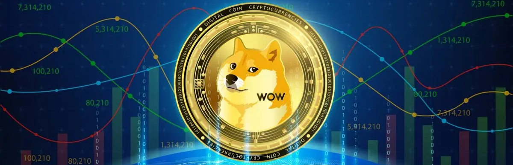
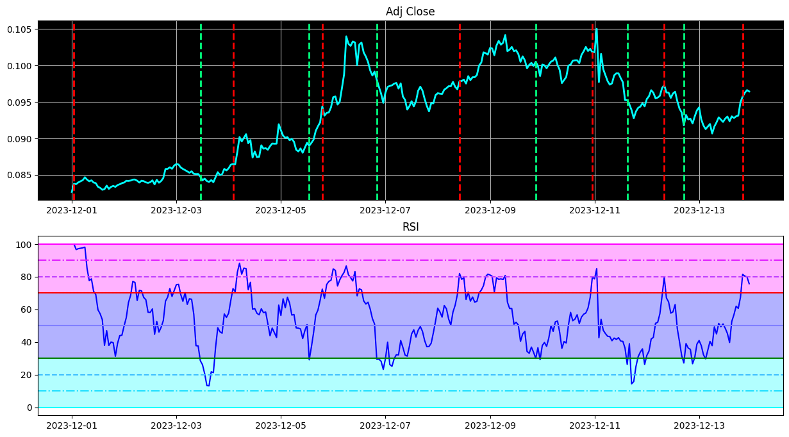

## Long Stocks Investing
:card_index_dividers: ```Stock selection.pdf``` - tiny investment pitch about stock picking based on sectors and companies information

:chart_with_upwards_trend: ```Stock ROI.ipynb``` - evaluating the ROI of stocks from ``Stock selection.pdf```

## Assets Analytics

:octocat: ```Task 1.ipynb``` -  data from yfinance, Adj Close/Close, quotes validation, simple moving average (SMA)

:cookie: ```Task 2.ipynb``` - linear dependence, correlation and covariance matrices, scatter plots

:watch: ```Task 3.ipynb``` - returns statistics, mean, std, distributions

:building_construction: ```Task 4.ipynb``` - hypothesis testing, ANOVA, Kruskal-Wallis, Student's t-test, Mann-Whitney U test, Levene's test

:milky_way: ```Task 5.ipynb``` - linear forecast, autocorrelation, Augmented Dickey-Fuller (ADF) test (checking if stock price a Random Walk process), moving average forecast, exponential smoothing forecast

:bow_and_arrow: ```Task 6.ipynb``` - stated trading strategy realisation

:battery: ```Task 7.ipynb``` - sectors (XL*) ETFs, market volatility comparison (March 2020 and 2022), diversification, Sharpe ratio, top 5 sectors

## Relative Strength Index & Dogecoin Trading Strategy  



:dog2: ```RSI Dogecoin.ipynb``` - notebook with presentation of ```rsi.py```

:coin: ```rsi.py``` - class for RSI strategy with getting signals,assessing profitable ones, running strategy, calibration parameters, different plots, testing





